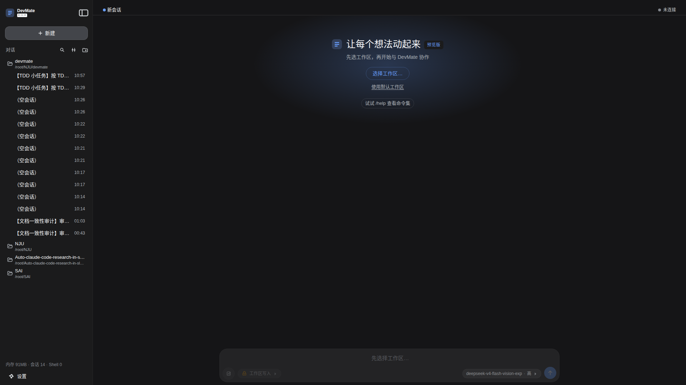
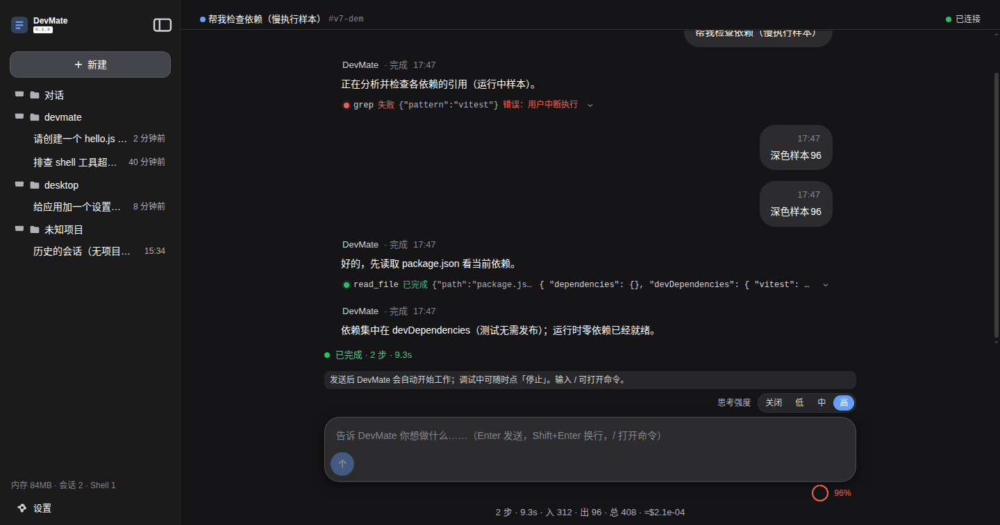
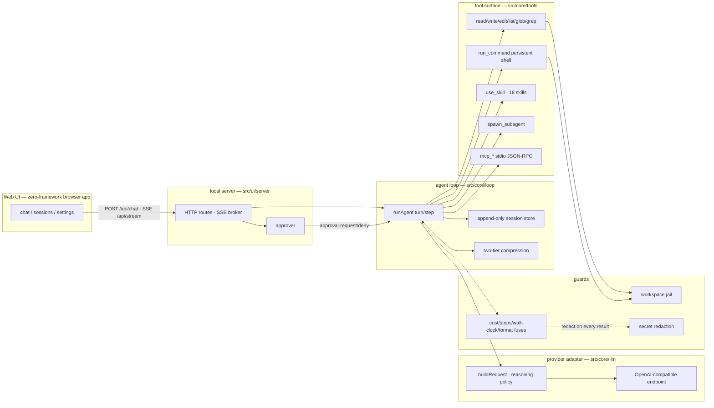

# DevMate

**@teresal/devmate-cli** — A TypeScript coding agent built from scratch: **zero frameworks, zero runtime dependencies** — compatible with any OpenAI-compatible LLM endpoint. The installed CLI binary is `devmate-cli`.

<p align="center">
  <a href="https://github.com/L77Doncic/devmate/actions/workflows/ci.yml"></a>
  <a href="https://www.npmjs.com/package/@teresal/devmate-cli"></a>
  <a href="LICENSE"></a>
  <a href="https://nodejs.org/"></a>
</p>

> **中文摘要**：DevMate 是一个从零实现的 TypeScript 编程智能体（npm 包 `@teresal/devmate-cli`，命令行二进制仍为 `devmate-cli`）——零框架、零运行时依赖，最底层只用 Node 原生能力（原生 `fetch` + 手写 SSE 解析器，见 [docs/adr/0001-zero-dependency-llm-client.md](docs/adr/0001-zero-dependency-llm-client.md)）。你给出一个编程任务，它在你的本机工作区里自主读写文件、执行命令、反复调用 OpenAI 兼容的 LLM，直至完成。它自带零依赖原生 Web UI（双主题、设置页、上下文占用环，视觉复刻 DeepSeek Harness 并已注明出处）、9 个内置工具 + MCP 动态合并的工具面、子代理工作流、18 个内化工程技能、按供应商适配的提示词与推理策略、以及「工作区监狱 + 危险操作审批 + 预算/隔离」三层安全基线。完整中文版见 [README.zh-CN.md](README.zh-CN.md)。

---

## Why DevMate?

DevMate is the "harness" part of an agent: given a task, it drives an LLM through an autonomous loop — gather context, act (file tools, commands), re-inject results, repeat — until the task is done or a guardrail fires. Everything a harness needs is implemented in-house and documented in 16 ADRs:

- **Zero dependency** — `dependencies: {}`. Native `fetch`, hand-written SSE parser, hand-written markdown renderer, zero-framework Web UI. No lockfile surprises, no supply chain surface, works anywhere Node 20 runs.
- **Own the loop** — steps, termination conditions, circuit breakers, error re-injection, retries (equal-jitter backoff + `Retry-After`), cost fuse: it is all visible, testable code in `src/core/`.
- **An append-only session** — every event (prompt, reasoning, tool calls and results, compactions) is appended to an event stream; resume, replay and audit are all views over the same source of truth.
- **A real UI** — the local web app ships in the package: dual themes, workspace-grouped sidebar, `/` commands, tool cards, approval modals, context meter, cost and step stats.
- **Safe by default** — workspace jail + approval + secret redaction + cost guard, with the unattended baseline decided in [ADR-0013](docs/adr/0013-safety-baseline.md).

## Features

- **Autonomous agent loop** ([`src/core/loop`](src/core/loop)) — Turn/Step model, natural end, submission markers, fuses (cost / steps / wall-clock), no-progress detection, circuit breaker for consecutive format errors, compaction debounce; the cost guard (`$3` default, the only default-on fuse) is fronted before every query.
- **Tool surface** ([`src/core/tools`](src/core/tools)) — 9 built-in tools: `read_file`, `write_file`, `edit_file` (SEARCH/REPLACE), `list_dir`, `glob`, `grep`, `run_command` (persistent shell with sentinel-line boundary detection), `use_skill` (lazy skill loader), `spawn_subagent` (parallel subagent pool); MCP server tools are appended to the same table with an `mcp_` prefix (`GET /api/tools` shows the live surface).
- **MCP integration** ([`src/core/mcp`](src/core/mcp)) — stdio JSON-RPC client: register servers in the settings page (`name` + `command` + `args`), toggle per server, tools merged into the loop automatically.
- **Skills inlining (18)** — the mattpocock-skills engineering set is bundled at build time into `dist/assets/skills`; the system prompt only carries a one-line index and `use_skill` lazy-loads a skill on demand (with per-skill toggles in the UI). A skill is a **directory**: `SKILL.md` plus the same directory's text assets (whitelist `*.md`/`*.txt`/`*.json`/`*.yaml`/`*.py`/`*.js`/`*.sh`, recursive, sorted by relative path, each appended under a `## <file:path>` section header; total injected payload capped at 20k chars — over-cap is cut in sorted prefix order, binaries/unknown types are skipped and announced in one note line). The loaded payload is bounded at 8k chars (same budget as the sub-agent injection). A URL-installed skill is a single `SKILL.md` file.
- **Subagent workflows** — `spawn_subagent` runs independent subtasks with a configurable parallel pool (`maxParallel` 0–8, default 2; 0 = no cap), enabled in Settings → Subagent; spawning with `skill:"code-review"` injects that skill's text (head-capped at 8000 code points) into the sub-agent's context (adoption of Claude Code subagent `skills` semantics — reviewer and main agent act on the same methodology text).
- **OpenAI-compatible providers** ([`src/core/llm`](src/core/llm)) — DeepSeek (default: `https://api.deepseek.com`, `deepseek-v4-flash`), OpenAI, DashScope/Qwen, Zhipu GLM, Kimi; per-provider adapters normalize `reasoning` handling, strict/parallel defaults, `finish_reason` vocabulary and error shapes.
- **Image understanding (DeepSeek vision, [ADR-0015](docs/adr/0015-deepseek-vision-and-token-limits.md))** — the composer accepts images (server-side content-addressed attachments: ≤20 MiB each, ≤20 per message, ≤200 MiB per session — dsh's three limits; bytes live under `<sessionsDir>/attachments/` as sha256 refs, events and session files stay slim) and expands them to DeepSeek's base64 `data:` URL wire shape for `deepseek-v4-flash-vision-exp`; other providers/models — and missing refs or request-size overflow (>40 MiB expanded) — degrade the message to text with an explicit note (never a 400; honest path). Token budget includes images (≤384 tokens per image, DeepSeek documented cap; estimation formula documented in ADR-0015). Per-image token math and limits: see [research/.scratch → deepseek-vision.md](../.scratch/coding-agent/research/deepseek-vision.md) (also shipped decision record).
- **Request-side token limits (Settings)** — **required** `输入上限 / 输出上限` (positive integers; the UI never allows saving without both, and `POST /api/settings` rejects missing values with 400 `max-input-output-required` — the server is the single enforcement point). GET always returns both: unset values are backfilled with defaults (output `8192` = `DEFAULT_MAX_TOKENS`; input = provider preset estimate) and flagged `maxOutputTokensDefault`/`maxInputTokensDefault` so the UI can say "used a default, please edit and save". Output limit maps to `max_tokens` (`max_completion_tokens` for OpenAI/Kimi); the input limit is only sent to whitelisted providers (DashScope/Qwen `max_input_tokens` via `extra_body` — DeepSeek's API has no such parameter, documented as unimplemented). **Clamping (ADR-0016)** — values above the provider cap are clamped at save time (`clampLimits`, preset-driven: output cap DeepSeek `393216` — measured valid range, Kimi/GLM `131072`; DashScope/OpenAI have no proven cap → left untouched), persisted as the clamped value and echoed with `maxOutputTokensClamped`/`maxInputTokensClamped` so the UI can say "已按 <model> 上限钳制为 N". The input limit is also the **budget cap**: the projected window budget is `min(three-source window, maxInputTokens)` — input-limit double semantics (DashScope wire field + local budget cap). The adapter re-clamps at the wire level (`buildRequest`), and any runtime 400 (context too long / `valid range of max_tokens`) is **self-healed**: `classifyContextError` upgrades compaction (forceLevel 0→1→2, ≤2 retries per turn, reset across turns) and retries the same turn instead of failing; the parsed cap (`[1, N]`) is learned for window clamping and reported in `windowDetail` as "由错误学习" (see ADR-0016).
- **Prompt engineering** ([`src/ui/server/deps.ts`](src/ui/server/deps.ts)) — a budget-aware system prompt (`devmate-cli` anchors: 界内动 / 小步闭环 / 失败是普通消息), skills index section, subagent section, and the persona is split per provider rather than copy-pasted into a monolith.
- **Native web UI** ([`src/ui/web`](src/ui/web)) — zero-framework HTML/CSS/ES Modules with no build step; dual themes (Light GitHub / Dark GitHub token sets), workspace-grouped sidebar, 13 `/` commands, reasoning-strength pill (off/low/medium/high), context-meter ring, run-status strip, `compaction` disclosure notes.
- **Context engineering** ([`src/core/context`](src/core/context)) — projection-only context management: tool-output truncation (head/tail + elide marker), tool-result pruning with placeholders, conversation summarization with debounce, token-budget estimate + server-usage calibration.
- **Safety baseline** — workspace jail (symlink-aware boundary), dangerous-op approval with re-injection on denial, secret redaction before re-injection, memory guard, config files written `0600` (POSIX semantics; Windows has no POSIX `chmod` — the mode claim applies on POSIX, hygiene on Windows is the adjacent `0700` directory plus Node's best-effort read-only mapping).

## Screenshots

The web app (dark theme):

| Welcome screen                                         | A completed run with tool cards, reasoning and the context meter |
| ------------------------------------------------------ | ---------------------------------------------------------------- |
|  |          |

## Architecture

```
┌──────────────────────────── Web UI (zero-framework, no build step) ───────────────────────────┐
│ chat view · settings · sidebar · tool cards · approval modal · context meter · / commands     │
└───────────────▲───────────────────────────────────────────────────────┬──────────────────────┘
          POST /api/chat · SSE /api/stream · POST /api/approval    settings & toggles
                │                                                      │
┌───────────────┴──────────────────────────────────────────────────────▼──────────────────────┐
│ local HTTP server (127.0.0.1) — src/ui/server : routing, SSE broker, approver, memory guard  │
└───────────────┬─────────────────────────────────────────────────────────────────────────────┘
                │  run options / events
┌───────────────▼─────────────────────────────────────────────────────────────────────────────┐
│ agent loop — src/core/loop : turn/step · fuses · circuit breaker · error re-injection ·       │
│ source-of-truth session store (append-only JSONL) · two-tier compression on the projection    │
└───────┬──────────────────────────────┬──────────────────────────────┬───────────────────────┘
        │                              │                              │
┌───────▼───────────────┐   ┌──────────▼──────────────┐   ┌───────────▼───────────────────────┐
│ provider adapter      │   │ tool surface            │   │ guards                            │
│ src/core/llm          │   │ src/core/tools          │   │ cost · steps · wall-clock · no-   │
│ buildRequest ·        │   │ 6 file tools (jail-     │   │ progress · compaction debounce    │
│ reasoning policy ·    │   │ checked)                │   │ + secret redaction on the way     │
│ hand-written SSE      │   │ run_command (persistent │   │ back (securedRegistry)            │
│ client                │   │ shell, sentinel line)   │   └───────────────────────────────────┘
└───────┬───────────────┘   │ use_skill (18 skills)   │
        │                   │ spawn_subagent (pool)   │
        ▼                   │ mcp_* tools (stdio RPC) │
 OpenAI-compatible API     └──────────────────────────┘
 (DeepSeek / OpenAI / Qwen /
  GLM / Kimi, or self-hosted)
```

Or as a Mermaid diagram:



## Quick Start

Requirements: **Node.js ≥ 20** (npm CLI included). No global install needed:

```bash
npx @teresal/devmate-cli web
```

The local server binds to `127.0.0.1` and opens your browser automatically. Starting `npx @teresal/devmate-cli web` in any project directory makes that directory the default workspace; add more workspaces from the hero picker or the sidebar. On startup the first screen asks you to **select or confirm a workspace** (default = the startup directory) before composing — choose one from the picker or click "使用默认工作区" to unlock the composer. New project? Point it at a workspace:

```bash
npx @teresal/devmate-cli web --workspace /path/to/your/project --port 7911 --no-open
```

Then configure a key — either **environment variables** or the web app's settings page:

```bash
# Bash / macOS / Linux — environment variables win over config file
export DEV_MATE_API_KEY=sk-xxxxxxxxxxxxxxxxxxxx
export DEV_MATE_BASE_URL=https://api.deepseek.com    # optional (default: DeepSeek)
export DEV_MATE_MODEL=deepseek-v4-flash              # optional
npx @teresal/devmate-cli web
```

```powershell
# PowerShell
$env:DEV_MATE_API_KEY = "sk-xxxxxxxxxxxxxxxxxxxx"
npx @teresal/devmate-cli web
```

Any OpenAI-compatible endpoint works (bearer auth + `messages/tools/SSE`), so switching providers never means switching harness. In the UI, Settings → 模型接口 accepts the same three values and writes them to `~/.devmate/config.json` (`0600`, directory `0700` — keys never enter the repository; both modes are POSIX semantics — Windows has no POSIX `chmod`, see the safety-baseline note).

CLI surface:

| Command                                                       | Effect                                                        |
| ------------------------------------------------------------- | ------------------------------------------------------------- |
| `devmate-cli web [--port N] [--workspace <path>] [--no-open]` | Start the local web mode (port defaults to 0 = auto-assigned) |
| `devmate-cli --version`                                       | Print the package version                                     |
| `devmate-cli --help`                                          | Print usage                                                   |

Running from source: `npm install && npm run build && node dist/cli/index.js web`.

## API Overview

Everything the UI does goes through these endpoints (`src/ui/server/index.ts`):

| Method                | Path                                                      | Purpose                                                                                                                                                                                                                                                                                                                                                                                                                                                                                                                                                                                                                                                      |
| --------------------- | --------------------------------------------------------- | ------------------------------------------------------------------------------------------------------------------------------------------------------------------------------------------------------------------------------------------------------------------------------------------------------------------------------------------------------------------------------------------------------------------------------------------------------------------------------------------------------------------------------------------------------------------------------------------------------------------------------------------------------------ |
| `GET`                 | `/api/stream?sessionId=…`                                 | SSE frame stream: `session-user` (optional `images`), `assistant-delta`, `reasoning`, `assistant-done`, `tool-start`, `tool-result`, `approval-request`, `usage`, `run-status`, `run-error`, `compaction`                                                                                                                                                                                                                                                                                                                                                                                                                                                                 |
| `POST`                | `/api/chat`                                               | Send a message / start (or resume) a run; optional `images: [{ref?,url?,width?,height?}]` (≤20; `ref` = sha256 content-addressed reference, or legacy `data:image/…` dataURL; over-limit → 413); returns `{sessionId}` (the echoing `session-user` frame carries the same `images`)                                                                                                                                                                                                                                                                                                                                                                                                                                                                        |
| `POST`                | `/api/attachments`                                        | Upload an image (content-addressed): body `{sessionId, dataUrl}` or `{sessionId, data, mediaType}` → 200 `{ref: "sha256/…", width?, height?}`; limits ≤20 MiB per image, ≤20 per message, ≤200 MiB per session (over-limit → 413 with error code)                                                                                                                                                                                                                                                                                                                                                                                                                                                                                                                                                                         |
| `GET`                 | `/api/attachments/<ref>`                                  | Raw image bytes back (immutable cache; the UI `img.src` target) — missing/invalid ref → 404                                                                                                                                                                                                                                                                                                                                                                                                                                                                                                                                                                                                                                                                                                                               |
| `POST`                | `/api/approval`                                           | Answer a pending approval (`approve` / `deny` + optional reason)                                                                                                                                                                                                                                                                                                                                                                                                                                                                                                                                                                                             |
| `POST`                | `/api/interrupt`                                          | Interrupt the running agent (a terminal `run-status` still flows over the stream)                                                                                                                                                                                                                                                                                                                                                                                                                                                                                                                                                                            |
| `GET`/`POST`          | `/api/settings`                                           | Read returns `{baseUrl, model, reasoning, apiKey? (masked), window?, maxInputTokens, maxOutputTokens, maxInputTokensDefault?, maxOutputTokensDefault?, maxInputTokensClamped?, maxOutputTokensClamped?, permission, methodFirst, reviewMode, windowDetail?, modelSanitized?, workspaceDir?, permissionConfirmedAt?}` (`model` is always sanitized — no `[N]m/k` UI suffix; token limits are always present, unset values backfilled with defaults; `*Clamped` = saved value was clamped to the provider cap; `workspaceDir` = the session's registered root); write **requires** `{baseUrl, model, maxInputTokens, maxOutputTokens}` plus optional `{apiKey?, reasoning?, windowTokens?, permission?, methodFirst?, reviewMode?}` — keys only ever echoed masked; missing token limits → 400 `max-input-output-required` |
| `GET`/`POST`/`DELETE` | `/api/sessions`, `/api/sessions/:id`                      | Session list (each item carries `workspaceRoot`), history replay (≤ 500 frames), create, delete (409 when active)                                                                                                                                                                                                                                                                                                                                                                                                                                                                                                                                            |
| `GET`                 | `/api/workspaces`                                         | Registered workspace roots: `{roots: [...]}` (the default root is the implicit first entry)                                                                                                                                                                                                                                                                                                                                                                                                                                                                                                                                                                                                                                                                                                                               |
| `POST`                | `/api/workspaces`                                         | Register a workspace root — body `{path}` (absolute, existing directory; canonical realpath; idempotent) → 200 `{roots: [...]}`                                                                                                                                                                                                                                                                                                                                                                                                                                                                                                                                                                                                                                                                                           |
| `GET`                 | `/api/workspaces/browse?path=…`                           | Read-only directory listing for the root picker (defaults to `os.homedir()`) — display only, no write path                                                                                                                                                                                                                                                                                                                                                                                                                                                                                                                                                                                                                                                                                                                |
| `DELETE`              | `/api/workspaces/:encodedRoot`                            | Unregister a root (`/` escaped as `%2F` in the segment): default root → 400, unregistered → 404                                                                                                                                                                                                                                                                                                                                                                                                                                                                                                                                                                                                                                                                                                                           |
| `GET`                 | `/api/stats`                                              | Process stats: `{rssMb, heapMb, sessions, activeShells, mcpServers, mcpTools, queuedSubagents, memoryGuard}`                                                                                                                                                                                                                                                                                                                                                                                                                                                                                                                                                 |
| `GET`                 | `/api/tools`                                              | The live tool definitions visible to the model                                                                                                                                                                                                                                                                                                                                                                                                                                                                                                                                                                                                               |
| `GET`/`POST`/`DELETE` | `/api/skills` · `/api/skills/:id` · `/api/skills/install` | Skill list (bundled + user-installed, each with `origin`), enable toggle, user-skill install — local skill directory or `raw.githubusercontent.com` URL, and uninstall (`DELETE /api/skills/:id`: user-sourced skills only; bundled → 404 `内置技能不可移除`; unknown id → 404). A skill is a directory (`SKILL.md` + text assets, injected ≤ 20k chars); URL installs carry a single `SKILL.md` file.                                                                                                                                                                                                                                                                                                                                                                           |
| `GET`                 | `/api/mcp` · `POST /api/mcp` · `POST /api/mcp/:name`      | MCP server list / register (`name`+`command`+`args`) / toggle                                                                                                                                                                                                                                                                                                                                                                                                                                                                                                                                                                                                |
| `GET`/`POST`          | `/api/workflow`                                           | Subagent config: `{subagentsEnabled, maxParallel}`                                                                                                                                                                                                                                                                                                                                                                                                                                                                                                                                                                                                           |

## Safety Model

Three complementary layers, plus always-on guards (design record: [ADR-0013](docs/adr/0013-safety-baseline.md), [ADR-0014](docs/adr/0014-hardening-violent-test.md), [CONTEXT.md](CONTEXT.md) §安全与隔离):

1. **Workspace jail** — the filesystem boundary. The launch directory is the default boundary; extra directories must be registered explicitly. Symlinks are checked at both ends (allow requires both, deny wins), and `>`/`>>` redirection targets are treated as writes. Note: the jail gate applies to fs tools and to _write_ targets of shell commands; shell commands that _read_ files (`cat /etc/passwd`) run freely — the jail is the model-facing boundary, not an OS sandbox (see 3).
2. **Approval** — the interaction shutter is `read-only` mode only: fs writes/edits and ask/deny-level commands (including `rm -rf`) pause the loop and call the user via a modal (`approval-request`); a denial with reason is re-injected into the model as an ordinary tool result so it can adapt (a bare denial ends the round). In `workspace-write` (the default) and `full-access`, **every command executes with no prompt** — including destructive ones (DevMate ships no OS sandbox; choosing the mode accepts that risk, and the UI's permission descriptions say so).
3. **Sandbox / resource limits** — OS-level isolation (container/VM, disabled network, ulimits) is the intended backing defense for unattended runs. The harness never trusts a string blacklist as a boundary; run unattended evaluations inside a container and cap the budget.

Always-on guards:

- **Secret redaction** — every tool result is masked before re-injection (`securedRegistry`), including error messages; the storage layer also masks `tool` result content before it hits disk (`JsonlFileAdapter`, default on — this is the final word: disk, resume and replay all carry the mask, so no credential ever appears twice in model-visible context). It covers common credential shapes (AKIA…, `ghp_…`, `sk-…` ≥ 24 chars, `Bearer`/`Basic`, PEM blocks) — short mock keys and exotic shapes are outside the pattern set.
- **Store hygiene** — `~/.devmate/config.json` and session files are written `0600` with `0700` dirs (session dir heals historical `0644`/`0755` files on startup; both POSIX semantics — Windows has no POSIX `chmod`, so the 0600/0700 mode claims apply on POSIX only); the API endpoint only ever returns a mask; the web UI never renders with `innerHTML` and enforces a `safeHref` whitelist + CSP.
- **Cost guard** — the only default-on fuse; `$3` per run, checked before every query and streamed-down mid-response with live usage calibration.
- **Memory guard** — idle shells are disposed past the RSS threshold, and `GET /api/stats` reports `memoryGuard` state.
- **Lifecycle** — `SIGINT` and `SIGTERM` both run the full graceful shutdown (server close → MCP launcher dispose → shells); MCP servers are spawned in their own process group and `close()` kills the group (`npm → sh → node` tree), with a 2 s grace before `SIGKILL`.

**MCP credential caveat (trusted-local-machine scenario)** — MCP servers like `mcp-remote` take API credentials as command-line arguments (`--header 'Authorization: Bearer …'`), which are visible in `ps`/`/proc/<pid>/cmdline` to any process on the same machine. DevMate cannot change that CLI; it only screens them from the API surface (`GET /api/mcp` masks Authorization args) and from errors. Running such a server is a local-trust decision: keep your machine single-user, or pass credentials through environment injection instead of headers when the server supports it.

## Development

```bash
npm install
npm run dev            # tsc -w incremental
npm run typecheck      # main tsconfig + test tsconfig
npm run lint           # eslint flat config + typescript-eslint + prettier conflict rule
npm test               # vitest run (130 test files, 1916 cases — 1915 passed, 1 skipped; full E2E suite runs on POSIX in CI — the Windows job gates lint + typecheck + build, and the win32 shell path (Git Bash / PowerShell probe) is exercised there by launch smoke, not by the POSIX-authored E2E semantics)
npm run test:watch
npm run format:check   # prettier --check . (CONTEXT.md and docs/adr/ are exempt by design)
npm run build          # tsc + copy static web assets + bundle skills into dist/
```

Build internals: `npm run build` runs `tsc`, then `scripts/copy-web.mjs` copies `src/ui/web` (no build step) and `scripts/copy-skills.mjs` bundles the mattpocock-skills engineering set into `dist/assets/skills` together with an aggregated license. If the plugin is not installed locally the build warns and ships an empty skills set — everything else still works.

Staying green: fixtures and mocks keep tests hermetic (no network, no keys). The mock-LLM end-to-end suite (`test/e2e/full-chain.test.ts`) exercises the real server + real jail + real persistent shell with an injected fake LLM — run it with `npx vitest run test/e2e`.

Where things live:

| Path               | What it is                                                               |
| ------------------ | ------------------------------------------------------------------------ |
| `src/core/loop`    | The agent loop: step engine, fuses, circuit breaker                      |
| `src/core/tools`   | Tool surface: fs tools, persistent shell, skill loader, subagent spawner |
| `src/core/llm`     | Hand-written LLM client, provider adapters, presets                      |
| `src/core/context` | Projection: truncation, pruning, summary, token estimation               |
| `src/core/jail`    | Workspace jail (symlink-aware)                                           |
| `src/core/session` | Append-only event stream, resume, pairing                                |
| `src/core/mcp`     | stdio JSON-RPC MCP client & registry                                     |
| `src/ui/server`    | HTTP server, SSE broker, approver, settings & tooling endpoints          |
| `src/ui/web`       | Zero-framework browser app (shipped as-is)                               |
| `docs/adr/`        | 16 architecture decision records                                         |
| `CONTEXT.md`       | Domain glossary & rules (single source of truth)                         |

## Troubleshooting

| <center>Problem</center>             | <center>What DevMate does</center>                                                                       | <center>What you can do</center>                                                                              |
| ------------------------------------ | -------------------------------------------------------------------------------------------------------- | ------------------------------------------------------------------------------------------------------------- |
| **429 / rate limited**               | Transport retries with equal-jitter backoff (base 500 ms, cap 20 s, 5 attempts), `Retry-After` respected | Lower the reasoning strength, switch to a less contended model slot, or retry later                           |
| **401 / invalid key**                | Settings endpoint returns only a masked key; error is shown in the UI                                    | Re-enter the key in Settings → 模型接口, or export `DEV_MATE_API_KEY` (env wins over the config file)         |
| **Context window / meter shows "—"** | Window unknown → estimation mode (`contextEstimateTokens` heuristics)                                    | Set an explicit `windowTokens` override in Settings when your model's window differs from the provider preset |

For everything else, file an issue describing the command, the stream frames around the failure, and the `run-status` you got.

## FAQ

**Is it really zero-dependency?** Yes — `dependencies: {}` in `package.json`; the transports are native `fetch` plus a hand-written SSE parser, the UI renderer is hand-written ES Modules, and the whole stack is Node-only (≥ 20).

**Which models work?** Anything behind an OpenAI-compatible Chat Completions endpoint: DeepSeek (default), OpenAI, DashScope/Qwen, Zhipu GLM, Kimi, or any self-hosted server. Per-provider adapters handle the observable differences (reasoning-content policy, sampling-parameter whitelists, strict defaults, error shapes).

**Where do the 18 skills come from?** They are the engineering skill set of the mattpocock-skills plugin, bundled at build time with its own aggregated license inside the package (`dist/assets/skills/LICENSE-mattpocock-skills.txt`); the agent reads each one lazily via `use_skill`.

**What happens when the model runs out of ideas?** Consecutive format errors, repeated failing tools or repeated actions trip the circuit breaker, and the reason is reported to you instead of silently burning money; a compaction that never converges degrades to an explicit error.

**How is this different from Claude Code?** Same mental model (a harness above a model, plus an event-stream session), simplified to a single local process: one binary, one server, one UI, no extensions marketplace, and any OpenAI-compatible key you already own.

**Is it safe to run unattended?** The recommended baseline per [ADR-0013](docs/adr/0013-safety-baseline.md): OS-level isolation + the default `$3` cost fuse. Approval flows are for interactive use — unattended runs must be guarded by isolation and budget, not by clicks.

## Docs & License

- [README.zh-CN.md](README.zh-CN.md) — 完整中文版
- [CONTEXT.md](CONTEXT.md) — domain glossary & rules (Chinese, single source of truth)
- [docs/adr](docs/adr) — 16 architecture decision records
- [src/ui/web/README-UI.md](src/ui/web/README-UI.md) — UI engineering notes (protocol, security constraints)

MIT © [DevMate contributors](LICENSE). Web UI visual design (theme tokens / component geometry) is derived from [DeepSeek Harness](https://github.com/deepseek-ai/deepseek-harness) (MIT License © 2026 DeepSeek); attribution and full notices in [THIRD-PARTY-NOTICES.md](THIRD-PARTY-NOTICES.md). Bundled skills are licensed under their own terms — see `dist/assets/skills/LICENSE-mattpocock-skills.txt`.

