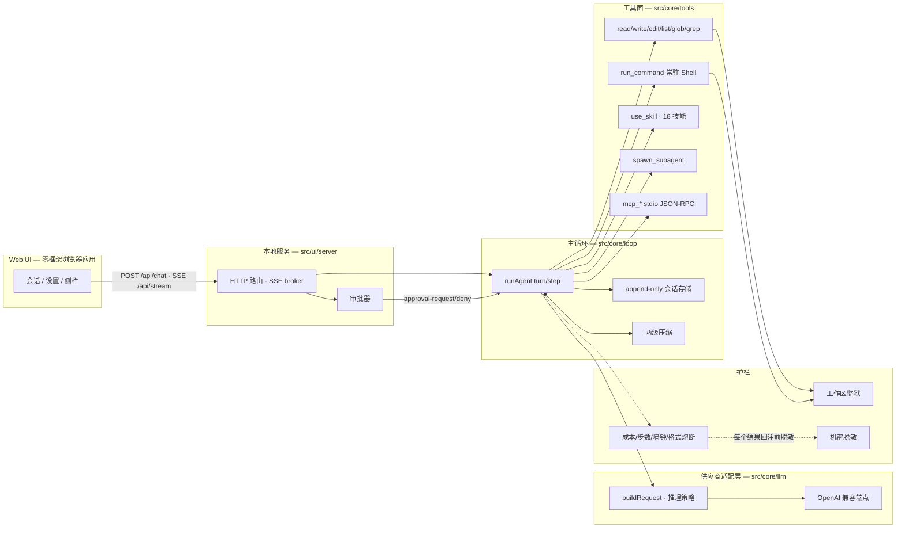

# DevMate

**devmate-cli** — 从零实现的 TypeScript 编程智能体：**零框架、零运行时依赖**——兼容任意 OpenAI 兼容的 LLM 端点。

<p align="center">
  <a href="https://github.com/L77Doncic/devmate/actions/workflows/ci.yml"></a>
  <a href="https://www.npmjs.com/package/devmate-cli"></a>
  <a href="LICENSE"></a>
  <a href="https://nodejs.org/"></a>
</p>

DevMate 是一个从零实现、零框架依赖的 TypeScript 编程智能体（npm 包 `devmate-cli`）：用户给出一个编程任务，它在本机工作区里自主读写文件、执行命令、反复调用 OpenAI 兼容的 LLM，直至完成。整个依赖栈的最底层只用 Node 原生能力——原生 `fetch` + 手写 SSE 解析器（见 [docs/adr/0001-zero-dependency-llm-client.md](docs/adr/0001-zero-dependency-llm-client.md)），对标简化版 Claude Code / DeepSeek Harness 式 harness。

## 为什么是 DevMate？

DevMate 是智能体（Agent）的「壳体」（harness）：给定一个任务，它驱动 LLM 自主循环——收集上下文 → 执行动作（文件工具、命令）→ 回注结果 → 再循环——直到任务完成或护栏命中。harness 所需的每一个机制都从零实现，并有 16 篇 ADR 记录在案：

- **零依赖**——`dependencies: {}`。原生 `fetch`、手写 SSE 解析器、手写安全 Markdown 渲染器、零框架 Web UI。没有锁文件意外、没有供应链暴露面，Node 20 能跑的地方它就能跑。
- **循环是自己的**——步（Step）、终止条件、熔断、错误回注、重试（Equal Jitter 退避 + `Retry-After`）、成本保险丝：全部是 `src/core/` 里可见、可测的代码。
- **append-only 会话**——每次事件（提示词、推理、工具调用与结果、压缩摘要）都追加进事件流；resume、回放与审计只是同一事实源的不同视图。
- **真的有个 UI**——原生 Web 应用随包发布：双主题、按工作区分组的侧栏、`/` 命令、工具卡、审批弹窗、上下文占用环、成本与步数统计。
- **默认安全**——工作区监狱 + 审批 + 机密脱敏 + 成本护栏；无人值守基线见 [ADR-0013](docs/adr/0013-safety-baseline.md)。

## 特性

- **自主智能体主循环**（[`src/core/loop`](src/core/loop)）——Turn/Step 模型、自然结束、提交信号、保险丝（成本/步数/墙钟）、无进展检测、连续格式错误熔断、压缩防抖；成本护栏（默认 `$3`，唯一默认开启的保险丝）前置每次查询之前。
- **工具面**（[`src/core/tools`](src/core/tools)）——9 个内置工具：`read_file`、`write_file`、`edit_file`（SEARCH/REPLACE）、`list_dir`、`glob`、`grep`、`run_command`（常驻 Shell，哨兵行界定输出）、`use_skill`（技能懒加载）、`spawn_subagent`（并行子代理池）；MCP 服务器工具以 `mcp_` 前缀追加进同一张表（`GET /api/tools` 可看实时工具面）。
- **MCP 接入**（[`src/core/mcp`](src/core/mcp)）——stdio JSON-RPC 客户端：设置页登记服务器（`name` + `command` + `args`）、逐个开关、工具自动合并进循环。
- **技能内化（18 个）**——构建时把 mattpocock-skills 工程技能集打包进 `dist/assets/skills`；系统提示只带一行清单，`use_skill` 按需懒加载 SKILL.md 全文（上限 4k 字符）；设置页可逐技能开关。
- **子代理工作流**——`spawn_subagent` 独立处理子任务，并行上限可配（`maxParallel` 1–4，缺省 2），设置页「Subagent」区开关；带 `skill:"code-review"` 创建时，该技能文本（上限 6000 码点，头截 + 标记）会注入子代理上下文（借鉴 Claude Code subagent `skills` 语义——审查员与主代理按同一方法论审查）。
- **OpenAI 兼容供应商**（[`src/core/llm`](src/core/llm)）——DeepSeek（默认：`https://api.deepseek.com` / `deepseek-v4-flash`）、OpenAI、阿里云百炼 DashScope/Qwen、智谱 GLM、Kimi；每家一个适配层归一化 `reasoning` 处置、采样参数白名单、strict 默认值、finish_reason 词汇与错误体形态。
- **图像理解（DeepSeek vision，[ADR-0015](docs/adr/0015-deepseek-vision-and-token-limits.md)）**——输入框可附加图片（服务端内容寻址附件：≤20MiB/图、每条消息 ≤20 张、单会话累计 ≤200MiB——dsh 三数；图片字节存 `<sessionsDir>/attachments/`，事件与会话文件只存 sha256 ref），`deepseek-v4-flash-vision-exp` 模型直接识别（截图文字/图表分析），请求时展开为 DeepSeek 协议的 base64 dataURL；其它供应商/模型自动降级为文本 + 说明（绝不 400）；ref 缺失/超 40MiB 同理降级（诚实路径）。token 预算含图像（每图 ≤384 token，官方上限；估算公式见 ADR-0015）。
- **请求侧 token 上限（设置页）**——**必填**「输入上限 / 输出上限」（正整数；UI 缺值即红字 + 禁存，`POST /api/settings` 缺任一即 400 `max-input-output-required`——服务端为强制口径单点）。GET 恒返回两值：存量缺失时回填缺省（输出 `8192`=DEFAULT_MAX_TOKENS；输入=供应商 preset 估算）并带 `maxOutputTokensDefault`/`maxInputTokensDefault` 标记（前端据此提示「已用默认，请修改保存」——不静默）。输出上限映射 `max_tokens`（OpenAI/Kimi 用 `max_completion_tokens`）；输入上限只发送给白名单供应商（DashScope/Qwen 走 `max_input_tokens`——DeepSeek 官方无此参数，不发送）。**钳制（ADR-0016）**——超过供应商上限的值在保存时钳制（`clampLimits`，preset 驱动：输出上限 DeepSeek `393216`——实测 valid-range、Kimi/GLM `131072`；DashScope/OpenAI 无据 → 不钳），持久化钳后值并回执 `maxOutputTokensClamped`/`maxInputTokensClamped`（UI 提示「已按 <model> 上限钳制为 N」）。输入上限同时是**预算上限**：投影窗口预算 = `min(三源窗口, maxInputTokens)`（输入上限双语义：DashScope wire 字段 + 本地预算上限）。适配层 wire 级再核（`buildRequest` 已知上限绝不 400）；运行时 400（上下文超窗 / `valid range of max_tokens`）**自愈不 fatal**：`classifyContextError` 升级压缩（forceLevel 0→1→2，每轮 ≤2 次重试、跨轮重置）后重试同轮；解析出的上限（`[1, N]`）被学习用于窗口钳制并在 `windowDetail` 报「由错误学习」（见 ADR-0016）。
- **提示词工程**（[`src/ui/server/deps.ts`](src/ui/server/deps.ts)）——预算感知的系统提示合成（锚定词：界内动 / 小步闭环 / 失败是普通消息）+ 技能清单节 + 子代理节，按供应商分离处理而不是堆进一段长文。
- **原生 Web UI**（[`src/ui/web`](src/ui/web)）——零框架 HTML/CSS/ES Modules、无构建步骤；双主题（浅色 GitHub / 深色 GitHub token 体系）、按工作区分组侧栏、12 条 `/` 命令、思考强度 pill（关闭/低/中/高）、上下文占用环、运行状态条、压缩披露小记。
- **上下文工程**（[`src/core/context`](src/core/context)）——只作用于投影的上下文管理：工具输出截断（保头尾 + 省略标记）、工具结果裁剪 + 占位符、对话摘要 + 防抖、token 预算估算 + 服务端 usage 校准。
- **安全基线**——工作区监狱（符号链接两端同检）、危险操作审批（拒绝原因回注）、回注前机密脱敏、内存警戒线、配置文件 `0600`（POSIX 语义；Windows 无 POSIX `chmod`——该权限主张仅 POSIX 有效，Windows 上的卫生由相邻 `0700` 目录与 Node 的只读位尽力映射承担）。

## 截图

Web 应用（深色主题）：

| 欢迎页 / 三步上手                                      | 一次完成运行：工具卡、推理与上下文占用环                 |
| ------------------------------------------------------ | -------------------------------------------------------- |
|  |  |

## 架构

```
┌───────────────────────── Web UI（零框架、无构建步骤）──────────────────────────┐
│ 会话视图 · 设置 · 侧栏 · 工具卡 · 审批弹窗 · 上下文占用环 · / 命令              │
└───────────────────▲──────────────────────────────────────┬───────────────────┘
              POST /api/chat · SSE /api/stream · /api/approval   设置开关
                    │                                            │
┌───────────────────┴──────────────────────────────────────────▼───────────────────┐
│ 本地服务（127.0.0.1）— src/ui/server：路由、SSE broker、审批、内存警戒线          │
└───────────────────┬──────────────────────────────────────────────────────────────┘
                    │  run 依赖 / 事件
┌───────────────────▼──────────────────────────────────────────────────────────────┐
│ 主循环 — src/core/loop：Turn/Step · 保险丝 · 熔断 · 错误回注 ·                   │
│ 唯一事实源会话存储（append-only JSONL）· 投影上的两级压缩                         │
└───────┬──────────────────────────────┬──────────────────────────┬────────────────┘
        │                              │                          │
┌───────▼───────────────┐   ┌──────────▼──────────────┐   ┌───────▼────────────────┐
│ 供应商适配层          │   │ 工具面                  │   │ 护栏                   │
│ src/core/llm          │   │ src/core/tools          │   │ 成本 · 步数 · 墙钟 ·   │
│ buildRequest · 推理   │   │ 6 件文件工具（走监狱）   │   │ 无进展 · 压缩防抖      │
│ 策略 · 手写 SSE 客户端│   │ run_command（常驻 Shell │   │ + 回注前机密脱敏       │
└───────┬───────────────┘   │ · 哨兵行）             │   └────────────────────────┘
        │                   │ use_skill（18 技能）    │
        ▼                   │ spawn_subagent（池）    │
 OpenAI 兼容 API           │ mcp_* 工具（stdio RPC）  │
（DeepSeek / OpenAI /      └──────────────────────────┘
  Qwen / GLM / Kimi / 自建）
```

Mermaid 版：



## 快速上手

要求：**Node.js ≥ 20**（含 npm）。无需全局安装：

```bash
npx devmate-cli web
```

本地服务绑定 `127.0.0.1` 并自动打开浏览器。在任意项目目录用 `npx devmate-cli web` 启动即可将其设为默认工作区；更多工作区用 hero 或侧栏添加。启动首屏需先**选择或确认工作区**（默认 = 启动目录）：目录弹窗选定或点「使用默认工作区」即解锁输入。换个工作区：

```bash
npx devmate-cli web --workspace /path/to/your/project --port 7911 --no-open
```

然后配置密钥——环境变量或 Web 设置页二选一：

```bash
# Bash / macOS / Linux —— 环境变量优先于配置文件
export DEV_MATE_API_KEY=sk-xxxxxxxxxxxxxxxxxxxx
export DEV_MATE_BASE_URL=https://api.deepseek.com    # 可选（默认 DeepSeek）
export DEV_MATE_MODEL=deepseek-v4-flash              # 可选
npx devmate-cli web
```

```powershell
# PowerShell
$env:DEV_MATE_API_KEY = "sk-xxxxxxxxxxxxxxxxxxxx"
npx devmate-cli web
```

任意 OpenAI 兼容端点都可用（Bearer 认证 + `messages/tools/SSE` 公共主干），换供应商无需换 harness。UI 中「设置 → 模型接口」接受同样的三项，写入 `~/.devmate/config.json`（`0600`，目录 `0700`——密钥永不进仓库；两权限皆 POSIX 语义——Windows 无 POSIX `chmod`，见「安全基线」注记）。

CLI 一览：

| 命令                                                          | 效果                                           |
| ------------------------------------------------------------- | ---------------------------------------------- |
| `devmate-cli web [--port N] [--workspace <path>] [--no-open]` | 启动本地 Web 模式（端口缺省 0 = 系统自动分配） |
| `devmate-cli --version`                                       | 打印版本号                                     |
| `devmate-cli --help`                                          | 打印帮助                                       |

源码运行：`npm install && npm run build && node dist/cli/index.js web`。

## API 概览

UI 的所有动作都走这些端点（`src/ui/server/index.ts`）：

| 方法                  | 路径                                                 | 用途                                                                                                                                                                                                                                                                                                                                                                                                                                                                                                                                     |
| --------------------- | ---------------------------------------------------- | ---------------------------------------------------------------------------------------------------------------------------------------------------------------------------------------------------------------------------------------------------------------------------------------------------------------------------------------------------------------------------------------------------------------------------------------------------------------------------------------------------------------------------------------- |
| `GET`                 | `/api/stream?sessionId=…`                            | SSE 帧流：`session-user`、`assistant-delta`、`assistant-done`、`tool-start`、`tool-result`、`approval-request`、`usage`、`run-status`、`run-error`、`compaction`                                                                                                                                                                                                                                                                                                                                                                         |
| `POST`                | `/api/chat`                                          | 发消息 / 启动（或续跑）一轮 run；可选 `images: [{url,width?,height?}]`（dataURL，≤6 张）；返回 `{sessionId}`（回显 `session-user` 帧携带同形 `images`）                                                                                                                                                                                                                                                                                                                                                                                  |
| `POST`                | `/api/approval`                                      | 应答待处理审批（`approve` / `deny` + 可选理由）                                                                                                                                                                                                                                                                                                                                                                                                                                                                                          |
| `POST`                | `/api/interrupt`                                     | 中断运行中的智能体（终态 `run-status` 仍经流到达）                                                                                                                                                                                                                                                                                                                                                                                                                                                                                       |
| `GET`/`POST`          | `/api/settings`                                      | 读返回 `{baseUrl, model, reasoning, apiKey?（掩码）, window?, maxInputTokens, maxOutputTokens, maxInputTokensDefault?, maxOutputTokensDefault?, maxInputTokensClamped?, maxOutputTokensClamped?}`（`model` 恒净化名——无 `[N]m/k` UI 尾标；上限恒回显，缺失回填缺省+Default 标记；`*Clamped` = 保存值被钳到供应商上限）；写**必填** `{baseUrl, model, maxInputTokens, maxOutputTokens}` + 可选 `{apiKey?, reasoning?, windowTokens?, permission?, methodFirst?, reviewMode?}` —— 密钥只回掩码；上限缺失 → 400 `max-input-output-required` |
| `GET`/`POST`/`DELETE` | `/api/sessions`、`/api/sessions/:id`                 | 会话列表（每项含 `workspaceRoot`）、历史回放（≤ 500 帧）、新建、删除（活跃时 409）                                                                                                                                                                                                                                                                                                                                                                                                                                                       |
| `GET`                 | `/api/stats`                                         | 进程统计：`{rssMb, heapMb, sessions, activeShells, mcpServers, mcpTools, queuedSubagents, memoryGuard}`                                                                                                                                                                                                                                                                                                                                                                                                                                  |
| `GET`                 | `/api/tools`                                         | 模型可见的实时工具定义                                                                                                                                                                                                                                                                                                                                                                                                                                                                                                                   |
| `GET`                 | `/api/skills` · `POST /api/skills/:id`               | 技能清单与启用开关                                                                                                                                                                                                                                                                                                                                                                                                                                                                                                                       |
| `GET`                 | `/api/mcp` · `POST /api/mcp` · `POST /api/mcp/:name` | MCP 服务器清单 / 登记（`name`+`command`+`args`）/ 开关                                                                                                                                                                                                                                                                                                                                                                                                                                                                                   |
| `GET`/`POST`          | `/api/workflow`                                      | 子代理配置：`{subagentsEnabled, maxParallel}`                                                                                                                                                                                                                                                                                                                                                                                                                                                                                            |

## 安全模型

三层互补防线 + 常开护栏（依据 [ADR-0013](docs/adr/0013-safety-baseline.md)、[ADR-0014](docs/adr/0014-hardening-violent-test.md)、[CONTEXT.md](CONTEXT.md)「安全与隔离」）：

1. **工作区监狱**——文件系统边界。启动目录为默认边界，额外目录须显式登记；符号链接两端同检（allow 须两端命中、deny 任一命中即拦）；`>`/`>>` 重定向目标按写入审查。注意：门只作用于 fs 工具与 shell 的**写入目标**；shell 命令的**读侧**（`cat /etc/passwd`）不受边界限制——监狱是模型侧边界，不是 OS 沙箱（见第 3 条）。
2. **危险操作审批**——唯一问询档 = read-only：fs 写/编辑与 ask/deny 级命令（含 `rm -rf`）暂停循环征询用户：UI 弹出审批弹窗（`approval-request`）；带理由拒绝的拒因作为普通工具结果回注给模型继续调整，无理由拒绝才结束本轮。workspace-write（默认）与 full-access 档**全部命令（含破坏性）零弹窗直接执行**——DevMate 无 OS 沙箱强制层，选档即接受风险，前端权限描述承担风险声明（deny 直拒路径已删除）。
3. **沙箱 / 资源限制**——操作系统级隔离（容器/VM、禁用网络、ulimit）是无人值守场景的兜底防线。harness 绝不把字符串黑名单当安全边界；无人值守评测请放进容器并压住预算。

常开护栏：

- **机密脱敏**——回注前统一掩码（`securedRegistry`）＋存储层落盘前掩码（`JsonlFileAdapter` 默认开，tool 结果 content——掩码即最终口径：磁盘/resume/回放一致）；错误信息同样打码。覆盖常见凭据形态（AKIA…、`ghp_…`、`sk-…`≥36、`Bearer`/`Basic`、PEM 块），短 mock 形态不在覆盖内。
- **存储卫生**——`~/.devmate/config.json` 与会话文件以 `0600` 写入、目录 `0700`（会话目录启动时把历史 0644/0755 存量一次性纠正；两者皆 POSIX 语义——Windows 无 POSIX `chmod`，0600/0700 主张仅 POSIX 有效）；端点只回掩码；Web UI 全文禁止 `innerHTML`、强制 `safeHref` 白名单 + CSP。
- **成本护栏**——唯一默认开启的保险丝：`$3`/任务，每次查询前预检、流式中超阈值即中止，带真实 usage 校准账本。
- **内存警戒线**——超过 RSS 阈值释放空闲 Shell，`GET /api/stats` 上报 `memoryGuard` 状态。
- **生命周期**——SIGINT 与 SIGTERM 走同一完整优雅关闭（server close → MCP launcher dispose → 常驻 Shell）；MCP 服务器以独立进程组启动，close() 按组终止（`npm → sh → node` 整树），2s 宽限后组 SIGKILL。

**MCP 凭据限制（本机信任场景）**——`mcp-remote` 类服务器把 API 凭据放在命令行参数（`--header 'Authorization: Bearer …'`），同机任何进程可从 `ps`/`/proc/<pid>/cmdline` 读取。DevMate 无法改变该 CLI（只在 API 响应面与错误里掩码）；使用即本机信任决策：保持单用户机器，或改用环境变量注入凭据。

## 开发

```bash
npm install
npm run dev            # tsc -w 增量编译
npm run typecheck      # 主 tsconfig + 测试 tsconfig 双重检查
npm run lint           # eslint flat config + typescript-eslint + prettier 冲突规则
npm test               # vitest run（90 文件，1231 用例）
npm run test:watch
npm run format:check   # prettier --check .（CONTEXT.md 与 docs/adr/ 按设计豁免）
npm run build          # tsc + 复制静态 Web 资产 + 打包技能到 dist/
```

构建内部：`npm run build` 先跑 `tsc`，再用 `scripts/copy-web.mjs` 复制 `src/ui/web`（无构建步骤），`scripts/copy-skills.mjs` 把 mattpocock-skills 工程技能集打包进 `dist/assets/skills` 并附聚合许可文本。本机未安装插件时构建会警告并带上空技能集——其余功能不受影响。

保持绿色：fixtures 与 mock 让测试完全封闭（无网络、无密钥）。mock-LLM 端到端套件（`test/e2e/full-chain.test.ts`）跑真实服务端 + 真实监狱 + 真实常驻 Shell，只注入假 LLM——用 `npx vitest run test/e2e` 运行。

代码地图：

| 路径               | 是什么                                         |
| ------------------ | ---------------------------------------------- |
| `src/core/loop`    | 主循环：步引擎、保险丝、熔断                   |
| `src/core/tools`   | 工具面：文件工具、常驻 Shell、技能加载、子代理 |
| `src/core/llm`     | 手写 LLM 客户端、供应商适配层、预设            |
| `src/core/context` | 投影：截断、裁剪、摘要、token 估算             |
| `src/core/jail`    | 工作区监狱（符号链接感知）                     |
| `src/core/session` | append-only 事件流、resume、配对               |
| `src/core/mcp`     | stdio JSON-RPC MCP 客户端与注册表              |
| `src/ui/server`    | HTTP 服务、SSE broker、审批器、设置与工具端点  |
| `src/ui/web`       | 零框架浏览器应用（原样随包发布）               |
| `docs/adr/`        | 16 篇架构决策记录                              |
| `CONTEXT.md`       | 领域术语与规则（单一事实来源）                 |

## 常见问题

**问题：429 / 限流。** DevMate 的处置：传输层重试——Equal Jitter 指数退避（base 500ms、cap 20s、5 次尝试），尊重 `Retry-After`。你可以：降低思考强度、换限流更宽的模型档位，或稍后再试。

**问题：401 / 密钥无效。** 设置端点只回显掩码密钥，错误会在 UI 展示。你可以：在「设置 → 模型接口」重新填写密钥，或导出 `DEV_MATE_API_KEY`（环境变量优先于配置文件）。

**问题：上下文窗口 / 占用环显示「—」。** 窗口未知 → 估算模式（`contextEstimateTokens` 启发式）。当你的模型窗口与供应商预设不符时，在设置里显式覆盖 `windowTokens`。

**真的是零依赖吗？** 是——`package.json` 里 `dependencies: {}`；传输层是原生 `fetch` + 手写 SSE 解析器；UI 渲染是手写 ES Modules；整个栈只用 Node（≥ 20）。

**哪些模型能用？** 任何 OpenAI 兼容的 Chat Completions 端点：DeepSeek（默认）、OpenAI、DashScope/Qwen、智谱 GLM、Kimi，或任意自建服务。各家的可见差异（推理内容处置、采样参数白名单、strict 默认值、错误体形态）由适配层归一。

**18 个技能是哪来的？** 来自 mattpocock-skills 插件的工程技能集，构建时打包进包内并附聚合许可（`dist/assets/skills/LICENSE-mattpocock-skills.txt`）；智能体通过 `use_skill` 懒加载每个技能。

**模型陷入死循环怎么办？** 连续格式错误、连续同类工具失败或重复动作会触发熔断，原因报给你而不是继续烧钱；压缩不收敛退化为显式报错。

**和 Claude Code 有什么不同？** 同样的心智模型（模型之上的 harness + 事件流会话），简化为单个本地进程：一个二进制、一个服务、一个 UI，没有扩展市场，用你已有的任意 OpenAI 兼容密钥。

**无人值守安全吗？** 推荐基线（[ADR-0013](docs/adr/0013-safety-baseline.md)）：OS 级隔离 + 默认 `$3` 成本保险丝。审批流只适用于交互模式——无人值守靠隔离与预算，不靠点击。

## 文档与许可

- [README.md](README.md) — English version
- [CONTEXT.md](CONTEXT.md) — 领域术语与规则（中文，单一事实来源）
- [docs/adr](docs/adr) — 16 篇架构决策记录
- [src/ui/web/README-UI.md](src/ui/web/README-UI.md) — UI 工程笔记（协议、安全约束）

MIT © [DevMate contributors](LICENSE)。Web UI 视觉设计（主题 token / 组件几何）复刻自
[DeepSeek Harness](https://github.com/deepseek-ai/deepseek-harness)（MIT License
© 2026 DeepSeek）；出处与完整声明见 [THIRD-PARTY-NOTICES.md](THIRD-PARTY-NOTICES.md)。
打包技能按各自许可条款分发——见 `dist/assets/skills/LICENSE-mattpocock-skills.txt`。
